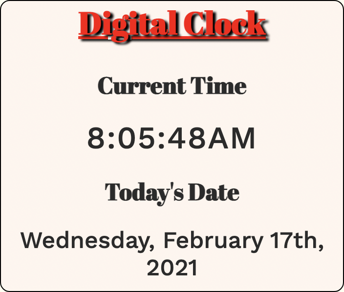

# JavaScript Digital Clock App

### A digital clock with date build with HTML, CSS, and JavaScript 

### See it [here](https://bryangk.github.io/digital_clock/)

## Summary
Doing this app was a great way to sharpen my skills on using date and time in JavaScript. Getting used to using the Google Chrome Developer Tools was also a great benefit. A first step in the right direction towards my goal of being a software developer.

## Author

Bryan Krauss - Full Stack Software Developer [LinkedIn](https://www.linkedin.com/in/bryan-krauss-556b3a200/)
